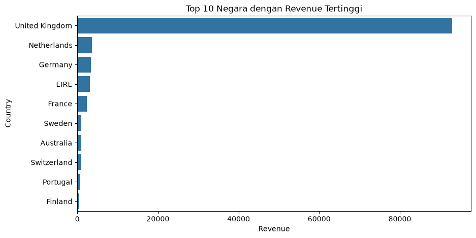

# Exploratory Data Analysis: E-commerce Sales Dataset

## Deskripsi Project
Project ini merupakan analisis eksploratif (Exploratory Data Analysis) terhadap dataset transaksi e-commerce (`ecommerce.csv`). Tujuannya adalah menjawab pertanyaan-pertanyaan bisnis seputar performa penjualan — mulai dari negara dan produk dengan performa terbaik, tren penjualan dari waktu ke waktu, hingga pola jam transaksi paling ramai — menggunakan teknik data manipulation dengan pandas dan visualisasi dengan matplotlib/seaborn.

## Latar Belakang
Sebagai seorang data analyst, saya diminta menganalisis data transaksi e-commerce untuk menggali insight yang dapat membantu pengambilan keputusan bisnis, seperti negara mana yang menjadi kontributor revenue utama, produk apa yang paling laris, serta kapan waktu transaksi paling ramai terjadi.

## Dataset
- **Sumber:** `ecommerce.csv`
- **Kolom utama:** `InvoiceNo`, `StockCode`, `Description`, `Quantity`, `InvoiceDate`, `UnitPrice`, `CustomerID`, `Country`

## Feature Engineering
Beberapa kolom baru dibuat untuk mendukung analisis:

| Kolom | Asal | Alasan |
|---|---|---|
| `Revenue` | `Quantity × UnitPrice` | `Quantity` dan `UnitPrice` sendiri-sendiri belum cukup menjelaskan total pendapatan aktual per transaksi |
| `Tahun`, `Bulan`, `Hari` | `InvoiceDate` | Memecah tanggal+waktu lengkap menjadi komponen terpisah agar bisa di-groupby untuk melihat tren dari waktu ke waktu |
| `Periode` (YYYY-MM) | `Tahun` + `Bulan` | Menggabungkan tahun dan bulan jadi satu kolom agar data bisa di-groupby dan diurutkan secara kronologis per bulan dalam satu langkah |
| `jam` | `InvoiceDate` | Mengetahui pada jam berapa transaksi paling banyak terjadi dalam sehari |

## Pertanyaan Analisa & Insight

**1. 10 negara dengan revenue tertinggi?**



`United Kingdom` mendominasi revenue secara signifikan dengan total 93.011,36 — sekitar 25,7 kali lipat lebih tinggi dari negara di ranking kedua, `Netherlands` (3.622,33). Bahkan gabungan revenue 9 negara lainnya masih jauh di bawah revenue UK sendiri, menunjukkan bisnis sangat bergantung pada pasar UK sebagai kontributor utama.

**2. Top 10 produk paling banyak terjual?**


`WHITE HANGING HEART T-LIGHT HOLDER` (1.291 unit) dan `CREAM HEART CARD HOLDER` (1.032 unit) menjadi dua produk terlaris, jauh di atas produk lainnya yang berada di kisaran 550–820 unit. Kesenjangan ini menunjukkan penjualan terkonsentrasi di sedikit produk andalan, sehingga stok untuk 2 produk teratas perlu diprioritaskan, sementara produk di ranking bawah bisa didorong lewat campaign tambahan.

**3. Tren penjualan setiap tahun?**


Penjualan tertinggi terjadi di November 2011 (~18.000), dengan tren kenaikan mulai terlihat sejak Agustus 2011. Titik terendah di Desember 2011 (~5.500) bukan penurunan sesungguhnya — data Desember 2011 hanya tersedia sampai tanggal 9, sehingga revenue-nya otomatis lebih rendah karena periode data belum lengkap sebulan penuh.

**4. Revenue 10 negara teratas per bulan?**


Revenue `United Kingdom` jauh mendominasi dibanding 9 negara lainnya di sepanjang periode, bahkan di titik terendahnya (~4.700) tetap jauh di atas gabungan negara lain yang seluruhnya berada di kisaran 0–1.000. Tren UK naik dari pertengahan 2011 dengan puncak di November 2011 (>16.000).

**5. Di jam berapa transaksi paling ramai?**


Transaksi mulai muncul sejak jam 07.00, meningkat tajam menuju puncaknya di jam 12.00, lalu berangsur menurun hingga hampir tidak ada transaksi di jam 20.00. Aktivitas belanja pelanggan terkonsentrasi di jam siang (sekitar 11.00–15.00), kemungkinan bertepatan dengan waktu istirahat/makan siang.

## Analisa Multivariate: Correlation Heatmap


Korelasi antar kolom numerikal (`Quantity`, `UnitPrice`, `Revenue`) menunjukkan `Quantity` dan `Revenue` memiliki korelasi paling kuat (0,79), sedangkan `UnitPrice` terhadap `Revenue` cenderung lemah (0,09) dan `UnitPrice` terhadap `Quantity` hampir tidak berkorelasi (-0,08). Ini menunjukkan bahwa revenue lebih banyak didorong oleh jumlah barang yang terjual (quantity) dibandingkan harga satuannya — strategi menaikkan harga saja tanpa menjaga volume penjualan kemungkinan tidak berdampak besar terhadap revenue.

## Tools & Libraries
- Python
- pandas
- matplotlib
- seaborn
- Jupyter Notebook

## Struktur File
```
├── Assigment day 20 Advance Exploratory.ipynb
├── README.md
├── ecommerce.csv
└── images/
    ├── top10_negara.png
    ├── top10_produk.png
    ├── tren_penjualan_bulanan.png
    ├── revenue_negara_per_bulan.png
    ├── transaksi_per_jam.png
    └── correlation_heatmap.png
```
